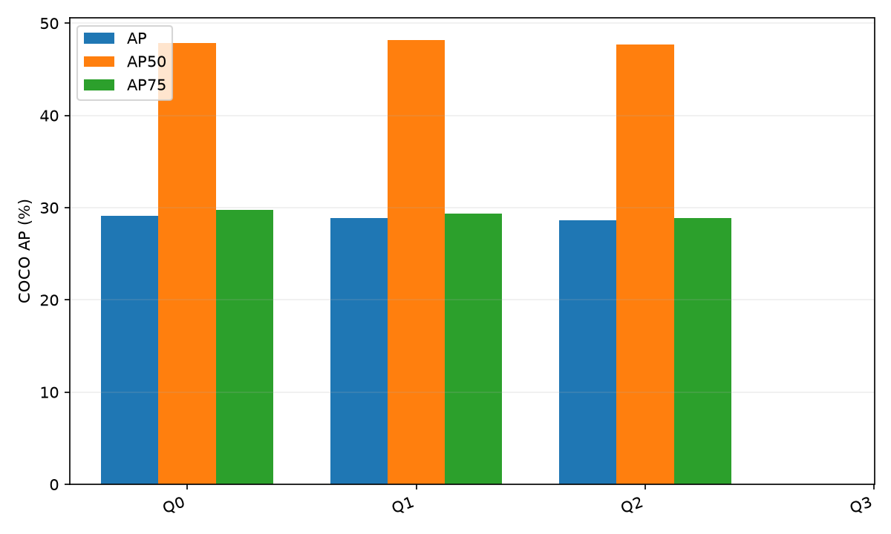
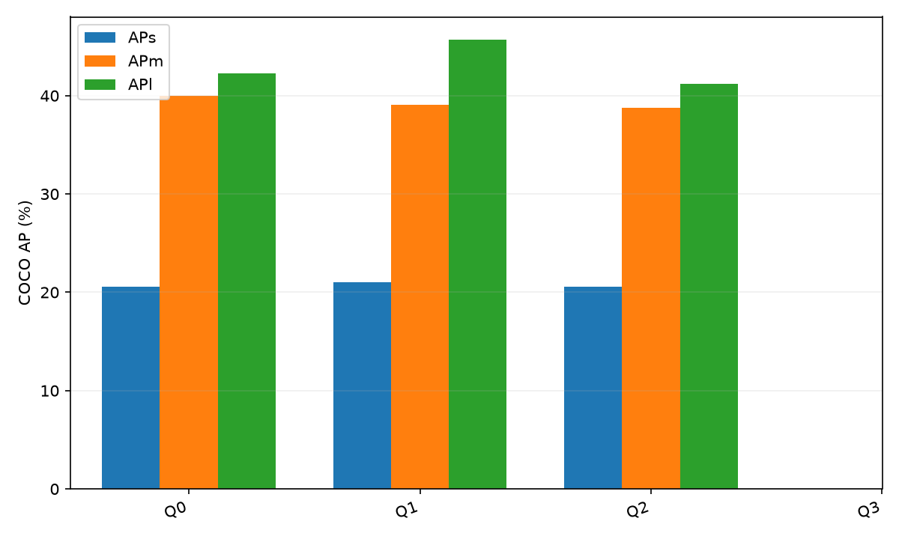
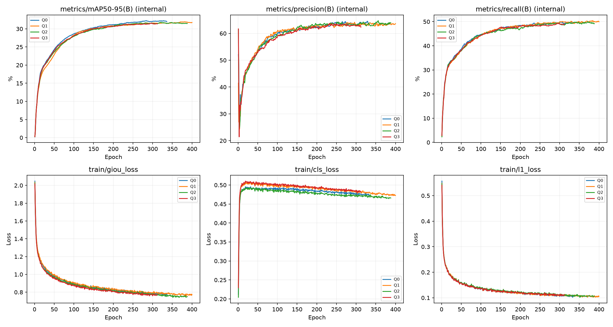

# SO-DETR 实验汇总

更新时间：2026-09-17T02:47:34.555749+00:00

COCO 指标以百分数显示，提升单位为百分点（pp）；JSON/CSV 保存 0–1 原始值。
Precision/Recall 来自最佳轮次的内部验证日志，不属于正式 COCOeval 12 项指标。
缺失或无有效 GT 的指标显示 —；历史训练状态不推测。不同配置的 AP 只供查看，不代表公平比较。

## 主结果

| 实验 / Run | 模式 | 评估状态 | AP | AP50 | AP75 | APs | APm | APl | ΔAP (pp) |
|---|---|---|---:|---:|---:|---:|---:|---:|---:|
| Q0 / Q0 | fixed | completed | 29.13 | 47.86 | 29.78 | 20.58 | 39.99 | 42.23 | 0.00 |
| Q1 / Q1 | adaptive-quality | completed | 28.90 | 48.16 | 29.36 | 21.05 | 39.06 | 45.73 | — |
| Q2 / Q2 | adaptive-regression | completed | 28.65 | 47.71 | 28.86 | 20.55 | 38.79 | 41.17 | — |
| Q3 / Q3 | adaptive-both | pending | — | — | — | — | — | — | — |

## 实验说明

### Q0

基线：固定 Expanded-IoU

训练状态：unknown；停止原因：未知；训练轮数：336；最佳轮次：284（best.pt checkpoint）。

相对 Q0：AP +0.00 pp，APs +0.00 pp，APm +0.00 pp，APl +0.00 pp。

数据说明：历史实验未记录训练状态、停止原因和耗时。

- [run](file:///home/ubuntu/%E6%96%87%E6%A1%A3/ZHJ_UAV/SO_DETR/runs/train/Q0)
- [best_weights](file:///home/ubuntu/%E6%96%87%E6%A1%A3/ZHJ_UAV/SO_DETR/runs/train/Q0/weights/best.pt)
- [results_csv](file:///home/ubuntu/%E6%96%87%E6%A1%A3/ZHJ_UAV/SO_DETR/runs/train/Q0/results.csv)
- [coco_metrics](file:///home/ubuntu/%E6%96%87%E6%A1%A3/ZHJ_UAV/SO_DETR/runs/train/Q0/formal_coco/best/coco_metrics.json)
- [args](file:///home/ubuntu/%E6%96%87%E6%A1%A3/ZHJ_UAV/SO_DETR/runs/train/Q0/args.yaml)

### Q1

Q1：仅质量监督使用尺度自适应 Expanded-IoU；其余训练配置与 Q0 一致

训练状态：completed；停止原因：epochs_completed；训练轮数：400；最佳轮次：382（trainer）。

数据说明：未找到唯一且配置、评估协议一致的 Q0；未计算提升。

- [run](file:///home/ubuntu/%E6%96%87%E6%A1%A3/ZHJ_UAV/SO_DETR/runs/train/Q1)
- [best_weights](file:///home/ubuntu/%E6%96%87%E6%A1%A3/ZHJ_UAV/SO_DETR/runs/train/Q1/weights/best.pt)
- [results_csv](file:///home/ubuntu/%E6%96%87%E6%A1%A3/ZHJ_UAV/SO_DETR/runs/train/Q1/results.csv)
- [coco_metrics](file:///home/ubuntu/%E6%96%87%E6%A1%A3/ZHJ_UAV/SO_DETR/runs/train/Q1/formal_coco/best/coco_metrics.json)
- [args](file:///home/ubuntu/%E6%96%87%E6%A1%A3/ZHJ_UAV/SO_DETR/runs/train/Q1/args.yaml)

### Q2

Q2：仅回归监督使用尺度自适应 Expanded-IoU；其余训练配置与 Q0 一致

训练状态：completed；停止原因：early_stopping；训练轮数：388；最佳轮次：348（trainer）。

数据说明：未找到唯一且配置、评估协议一致的 Q0；未计算提升。

- [run](file:///home/ubuntu/%E6%96%87%E6%A1%A3/ZHJ_UAV/SO_DETR/runs/train/Q2)
- [best_weights](file:///home/ubuntu/%E6%96%87%E6%A1%A3/ZHJ_UAV/SO_DETR/runs/train/Q2/weights/best.pt)
- [results_csv](file:///home/ubuntu/%E6%96%87%E6%A1%A3/ZHJ_UAV/SO_DETR/runs/train/Q2/results.csv)
- [coco_metrics](file:///home/ubuntu/%E6%96%87%E6%A1%A3/ZHJ_UAV/SO_DETR/runs/train/Q2/formal_coco/best/coco_metrics.json)
- [args](file:///home/ubuntu/%E6%96%87%E6%A1%A3/ZHJ_UAV/SO_DETR/runs/train/Q2/args.yaml)

### Q3

Q3：查询质量监督与回归损失均使用尺度自适应 Expanded-IoU

训练状态：failed；停止原因：AcceleratorError；训练轮数：312；最佳轮次：296（trainer）。

数据说明：尚无正式 COCOeval 结果。

- [run](file:///home/ubuntu/%E6%96%87%E6%A1%A3/ZHJ_UAV/SO_DETR/runs/train/Q3)
- [best_weights](file:///home/ubuntu/%E6%96%87%E6%A1%A3/ZHJ_UAV/SO_DETR/runs/train/Q3/weights/best.pt)
- [results_csv](file:///home/ubuntu/%E6%96%87%E6%A1%A3/ZHJ_UAV/SO_DETR/runs/train/Q3/results.csv)
- [coco_metrics](file:///home/ubuntu/%E6%96%87%E6%A1%A3/ZHJ_UAV/SO_DETR/runs/train/Q3/formal_coco/best/coco_metrics.json)（文件不存在）
- [args](file:///home/ubuntu/%E6%96%87%E6%A1%A3/ZHJ_UAV/SO_DETR/runs/train/Q3/args.yaml)

## 图表

